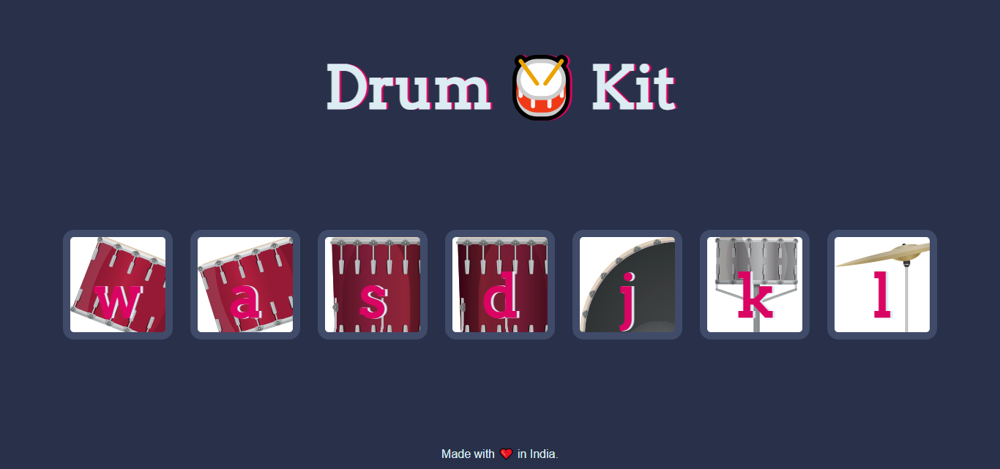

# 🥁 Drum Kit – Interactive Web App

## 🚀 Live Demo
[View Live Demo](https://karuppaiya-dev.github.io/drum-kit-javascript/)

This is a fun and interactive **Drum Kit web application** built using **HTML, CSS, and JavaScript**.  
Users can play drum sounds by **clicking buttons** or **pressing keyboard keys**.

## 🎯 What it includes
- Interactive drum buttons  
- Keyboard support (w, a, s, d, j, k, l)  
- Real-time sound playback  
- Button press animation effect  
- Clean and responsive UI  

## 🛠️ Technologies Used
- HTML5  
- CSS3  
- JavaScript (Vanilla JS)

## 🎓 Learning Purpose
This project was created as a **self-training project to practice JavaScript DOM manipulation, event handling, and audio handling**.

## ▶️ How to run
Just open the `index.html` file in any modern browser and:
- Click the drum buttons  
- OR press the corresponding keyboard keys 🥁

## 🎹 Key Mapping
- **W** – Tom 1  
- **A** – Tom 2  
- **S** – Tom 3  
- **D** – Tom 4  
- **J** – Kick Bass  
- **K** – Snare  
- **L** – Crash  

## 📷 Preview

  

